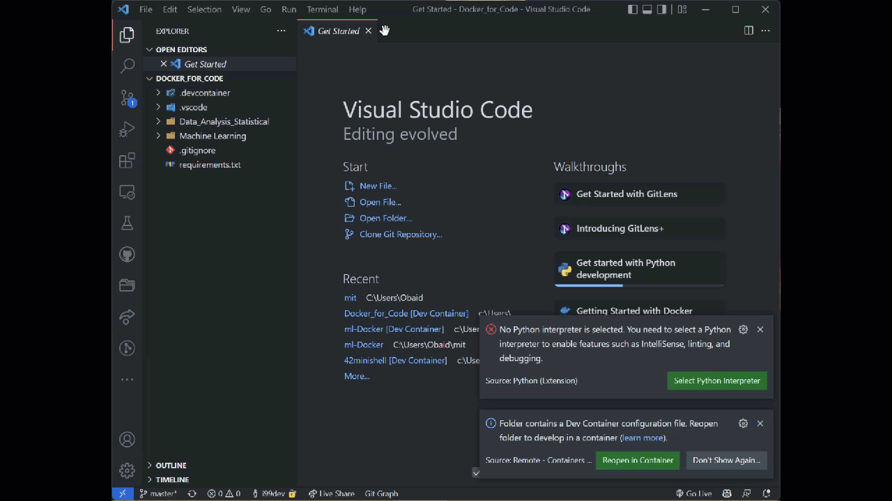

# MicroMasters® Program in Statistics and Data Science.

## How use this devContainer? 

clone this repository
```sh
git clone https://github.com/i99dev/Statistics-and-Data-Science
```

next from cmd or your terminal
```sh
cd Docker_for_code && code .
```

when vscode its open  and make sure you root is insaid the docker_for_code folder





## What is docker_for_code?
its all my note I wrote when i was learning MicroMasters®. included with all python libraries. you need for this coures.


## What is microMasters?
[MicroMasters®](https://micromasters.mit.edu/) is a program in statistics and data science. provided by the University of Michigan.

## How i use without your note?

clone repository and remove any folder insaid Docer_for_code. and keep the folders .devcontainer and .vscode.

and lastly, you need to run the following command in the terminal.

```
rm -rf .gitignore
```
